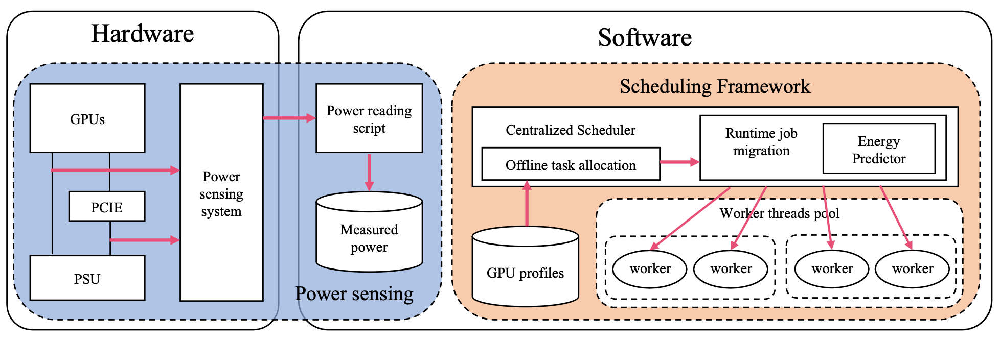

# sBEET-mg

This repository contains the software implementation of our work published in RTSS 2022.


## Publications
The description of the framework can be found in the following papers in RTSS 2022 and RTSS 2021:

* Yidi Wang, Mohsen Karimi, and Hyoseung Kim. Towards Energy-Efficient Real-Time Scheduling of Heterogeneous Multi- GPU Systems. IEEE Real-Time Systems Symposium (RTSS), 2022. [link to paper](https://intra.ece.ucr.edu/~hyoseung/pdf/rtss2021_sBEET.pdf)
* Yidi Wang, Mohsen Karimi, Yecheng Xiang, and Hyoseung Kim. Balancing Energy Efficiency and Real-Time Performance
in GPU Scheduling. IEEE Real-Time Systems Symposium (RTSS), 2021. [link to paper](https://intra.ece.ucr.edu/~hyoseung/pdf/RTSS22_sBEET-mg.pdf)

How to cite:
```
@INPROCEEDINGS {rtss2021_sbeet, author = {Y. Wang and M. Karimi and H. Kim}, booktitle = {2022 IEEE Real-Time Systems Symposium (RTSS)}, title = {Towards Energy-Efficient Real-Time Scheduling of Heterogeneous Multi-GPU Systems}, year = {2022}}
```

```
@INPROCEEDINGS {rtss2022_sbeet-mg, author = {Y. Wang and M. Karimi and Y. Xiang and H. Kim}, booktitle = {2021 IEEE Real-Time Systems Symposium (RTSS)}, title = {Balancing Energy Efficiency and Real-Time Performance in GPU Scheduling}, year = {2021}}
```

## How to Run
Note that the profiles and the code are designed for the hardware combination of RTX3070 and T400.
The code of power monitoring is designed for [Adafruit Feature nRF52](https://www.nordicsemi.com/products/nrf52832) and [Adafruit INA260 power sensor](https://www.ti.com/product/INA260).

### Download tasksets and GPU profiles
The tasksets and the GPU profiles we used in the paper can be downloaded via this link:
https://drive.google.com/drive/folders/1f5VcHiX-WIG1mJpsD7sTBCtLl6yMNYFW?usp=sharing

In order for the program to find the profiles, please extract profiles.zip to the workspace folder.

### Run a single taskset
1. Launch power sensing program
	```
	python3 tools/power_sensing/read_uart.py -o <output file>
	```
2. Launch the scheduler
	```
	./main -f <path to taskset> -d <duration (s)> -p <scheduling policy>
	```

### Argument options
Run ```./main -h``` to print usage information and exit:
```
$ ./main -h
Usage:
	-h Display usages and help
	-f Path to the taskset
	-d Emulating duration (s) for the taskset
	-p Scheduling policies:
		sbeet-mg: the proposed work in RTSS 2022 publication
		lcf: little-core-first method
		bcf: big-core-first method
		ld: load distribution method
		bfd-sbeet: best-fit-decreasing offline heuristic with original sBEET
		ffd-sbeet: first-fit-decreasing offline heuristic with original sBEET
		wfd-sbeet: worst-fit-decreasing offline heuristic with original sBEET
```

### Results Interpretation
The results of each single taskset will be saved to ```output/<taskset>/<policy name>/```, in the format of csv. For exmaple:
```
example/taskset_08022022/set_u08/000.csv,21:59:42.166,21:59:47.166,156,0,347.406
example/taskset_08022022/set_u08/001.csv,21:59:49.493,21:59:54.493,189,0,344.263
example/taskset_08022022/set_u08/002.csv,21:59:55.507,22:00:00.507,198,0,338.454
example/taskset_08022022/set_u08/003.csv,22:00:01.861,22:00:06.861,150,0,369.531
...
```
From left to right, the column headers are "taskset name", "starting time", "end time", "total number of jobs", "number of missed jobs", "estimated energy consumption" respectively.

The results of measured power consumption will also be saved in the same folder in the format of csv.